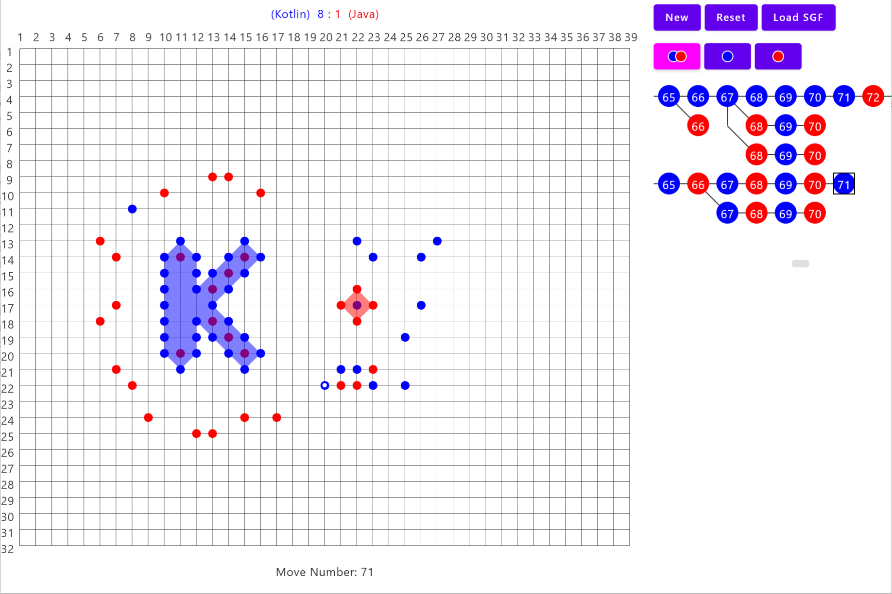

# Dots game

*The project's title is working and will be changed later.*

*The screenshot demonstrates current GUI features, but not a real game situation.*

[From Wikipedia](https://en.wikipedia.org/wiki/Dots_(game)):

> Dots (Czech: Židi, Polish: Kropki, Russian: Точки) is an abstract strategy game, played by two or more people on a sheet of squared paper. The game is somewhat similar to Go, in that the goal is to "capture" enemy dots by surrounding them with a continuous line of one's own dots. Once an area containing enemy dots is surrounded, that area ceases to be playable.

The project has the following goals:

* Demonstrate Kotlin [Compose Multiplatform](https://www.jetbrains.com/compose-multiplatform/) technology in application to board games.
  Also, GUI simplifies interaction with the engine,
  since it provides visual and interactive representation, and it's just fun.
* Demonstrate the use of the Kotlin language and its infrastructure for tasks related to AI technologies (deep learning).
* Practice out different algorithms:
  * Fast geometric/bitwise algorithms for game board (field) representation and manipulation.
  * AI-related algorithms:
    * [Zobrist hashing](https://en.wikipedia.org/wiki/Zobrist_hashing)
    * [Monte Carlo tree search](https://en.wikipedia.org/wiki/Monte_Carlo_tree_search) (classic alpha-beta and other pruning algorithms currently are not suitable)
    * Deep learning
    * Other
  * Other algorithms (lexing, parsing, dynamic algorithm for game tree nodes rendering)
* Try out different Dots game variants to figure out which one is the most interesting and balanced
* Find bugs and nitpicks in Kotlin compiler (for instance, I've found the following one: [KT-74875](https://youtrack.jetbrains.com/issue/KT-74875/K2-Confusing-and-false-positive-error-on-incorrect-code-with-UNRESOLVEDREFERENCEWRONGRECEIVER))
* Try out the experimental idea:
  Train [Junie](https://www.jetbrains.com/junie/) or other AI assistant to play Dots (well, Go is also fine). 
  The problem is that LLM assistants are not built for playing games; they understand a game situation very badly.
  However, it's worth trying to train them by samples set to study in a combination of image input (if it's supported).
  The hypothesis is: probably it's possible to adopt the cutting-edge LLM reasoning for MCTS emulating.

## Why Dots?

This is the game for ones who love pure abstractness
and don't want to be distracted by fantasy/other lore that is often used for
social board games.
That's why I'm comparing it only with some abstract games,
even precisely with [perfect info](https://en.wikipedia.org/wiki/Perfect_information) games,
because non-perfect info games are also too different.

*TODO: add more comprehensive and detailed info, add a comparison table.*

### [Reversi](https://en.wikipedia.org/wiki/Reversi)

The game is based on highly dynamic game development: every move can change the field dramatically.
The hypothesis: such kinds of situations are hard to follow by any human.
Also, the game is generally solved (for small boards),
and currently it's impossible to beat average bots even on low-level PC.

### Chess

* The game is very popular, and there are some superhuman bots that beat top-level players easily (the most known in https://stockfishchess.org/).
* The game has only a binary non-neutral outcome: your of opponent mate. The more level you have, the higher the probability of draw becomes.
* The game is also quite dynamic it trains other search skills unlike "additive" games like the Go game below.

### [Go](https://en.wikipedia.org/wiki/Go_(game)#Computers_and_Go)

The game can be considered a sibling to the Dots game because both games have some conceptions in common.
However, some things are different.

* The Go game score counting is confusing, especially for beginners.
  Also, personally, it's more sporty to count visual markers instead of crosses on the field.
* The second problem related to the first one: Go game has different scoring systems: Area (Chinese) and territory (Japanese).
  The first one is beginner-friendly but takes longer to count. Also, it struggles when applied to a Seki situation.
  The second wide is more widespread, but players should take care about placing stones into their own territory; otherwise they could lose score.
  Both score scoring systems are not ideal and require some effort to calculate the score at the end of the game.
* The game still has a dynamic nature:
  [Ko fight](https://en.wikipedia.org/wiki/Ko_fight#:~:text=The%20existence%20of%20ko%20fights,forbidden%2C%20for%20one%20turn%20only.).
  However, they are quite rare compared to Chess and Reversi.
  Also, the game has conceptions hard to grasp like [Seki](https://senseis.xmp.net/?Seki).
* The game requires an inventory: game board and stones. Since the game is not so popular as Chess, it's often not possible to find the inventory for offline games.
* The game has superhuman bots.
  The most known is [AlphaGo](https://en.wikipedia.org/wiki/AlphaGo),
  [AlphaZero](https://en.wikipedia.org/wiki/AlphaZero),
  but open-source analogues also exist: [KataGo](https://github.com/lightvector/KataGo).
  There is almost nothing to discover in this area for Go, but the approach can be adopted for Dots.

## Why not Dots?

Potential "draw problem" or even a slight advantage of the player who moves first.
Actually, Go definitely has first-player advantage and it's compensated by [Komi](https://en.wikipedia.org/wiki/Komi_(Go)).
Unfortunately, Komi is unlikely applicable to Dots, because it gives too much advantage, even it's `0.5` score,
because it can be hard to capture even one dot.
However, the draw problem is only a hypothesis, without a strict proof.

I came up with some ideas of different variants that can be tested.
For instance, the variant where border also captures (like in Go), but the main difference remains the same:
scoring by captured dots, but not territory.
The border-capturing is performed by the smallest territory or by a territory at player discretion in case of equal-size territory ambiguity 
The rule prevents situations where a player can capture the entire board.
Also, the minimal-territory-by-border rule internally fits the regular surrounding rule: the last one is also performed by a minimal territory.

(*TODO: add more details*).

## Conclusion

* The Dots game requires the simplest inventory possible: only a piece of cross-sheet paper and two pencils of different colors.
  It can be easily played offline. 
* The game has the simplest rules (and scoring) that make the game straightforward to start. However, the game still remains hard-to-master.
* The game is purely additive (the dots are never removed but only added). This makes the game more intuitive for humans and probably harder for computers.
* The game currently doesn't have a superhuman or even average-level (my) AI bot
* Last but not least: I like the game. I've encountered a lot of interesting situations on the field, and I believe it trains both tactics and strategic skills.

# Roadmap

* [x] Implement data structures and algorithms for field representation:
  * [x] Fast rollback/switch between game positions (use diff info instead of full field snapshots)
  * [x] Implement convenient testing infrastructure (using a text-based format for game states representation). *TODO: add description.*
  * [ ] Think about incremental field update or structures that hold additional useful info (it can be useful for moves traversing during network training, because hardware is limited or expensive)
* Implement an initial version of GUI using Compose Multiplatform
  * [x] Field component
  * [x] Game Tree component
  * [ ] State saving and loading
  * [ ] Visual representation of AI engine internals (like [katrain](https://github.com/sanderland/katrain))
  * [ ] Network protocol and game mode
  * [ ] Other issues
* SGF ([Smart Game Format](https://en.wikipedia.org/wiki/Smart_Game_Format))
  * [x] Implement SGF parser
  * [x] Implement SGF converter to an internal representation
  * [ ] Test how it works on available SGF databases (playdots, [zagram.org](https://zagram.org/eidokropki/index.html))
* Experiment and develop an AI bot for dots with classic rules
  * [ ] Implement MCTS algorithm (Monte Carlo Tree Search)
  * [ ] Implement additional algorithms that can be useful (Zobrist hashing)
  * [ ] Try to adopt [KataGo](https://github.com/lightvector/KataGo) algorithms for network learning and inference (write Kotlin bindings for neural network libraries)
  * [ ] If it's not possible to adopt the above-mentioned engine, fork it, port algorithms and use it as an external CLI tool
  * [ ] After the neural network is built, prove or disprove Dots draw or first-player-advantage problem
* [ ] Try out other Dots/Go variants, figure out if any is fun enough and balanced. Investigate https://www.govariants.com/
* [ ] Try to train general LLM-based assistants to play Dots or at least Go